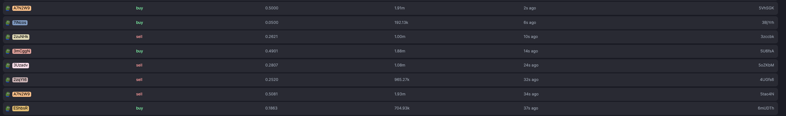

## Test contract

## Data points

Take data before this hash, to get the info of the bonding curve: 6mUDThYGDNxnBrgfap9hjnr9v8fjTCvYxfr1cy2S4enedNJfbADAfMkSMXtKBGrMCDcjUn9XVb2eQMNhDa2nk6Y

Below is the list of transaction after this timestamp / hash (approximately)

## Outputs

